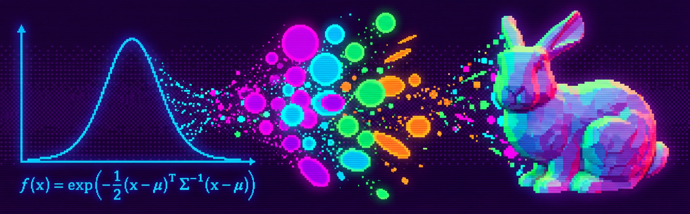

# Gaussian Splatting Course

---

---

**[🇷🇺 Русский](README_ru.md)**

## What This Is
Gaussian Splatting is a way to turn regular photographs into a 3D scene you can view from any angle. In real time. A 2023 technology. Used in VR/AR, film, cartography, digital twins.

This course explains how it works. From the inside. From the math of a single element to running it on a GPU.

---

## Why I Made This

I started learning Gaussian Splatting and quickly realized: I can't freely read the papers. Too much math, too few examples. I need analogies, concrete numbers, code — not half-page formulas with no explanation of what they mean.

A free course that would take me from zero to understanding — I couldn't find one. In the paid segment, literally a couple of courses of questionable quality. So I started building my own. The kind that would make sense to me from day one. I dig into the topic, structure it, write it up. Where I fall short — I use AI as an editor and co-author to make the explanations cleaner than I'd write alone.

The course grows with me.

---

## Who This Is For

Engineers, enthusiasts, and anyone who writes code and wants to understand how this works.

I'm not a mathematician. I'm a CV/3D engineer. If I figured it out — so can you.

---

## Prerequisites

Not much, but these are non-negotiable:

- **Python** — confident. If you're googling "how to write a for loop" — learn Python first.
- **PyTorch** — basics. Tensors, autograd, backward(), optimizer.step().
- **Linear algebra** — matrix multiplication, transpose, what a vector is. Not theorem proofs — just understanding what `A @ B` does.

---

## Structure

| # | Status | Lesson | Topic |
|---|--------|--------|-------|
| 01 | ✅ | What is Gaussian Splatting | [Why it matters, how 3D approaches evolved, the key idea](lessons/en/lesson-01-en.md) |
| 02 | ✅ | Gaussian Math | [Breaking it down brick by brick: position, covariance, shape](lessons/en/lesson-02-en.md) |
| 03 | ⬜ | Rendering | How Gaussians become pixels |
| 04 | ⬜ | Training | How the model learns: loss, gradients, adaptive density control |
| 05 | ⬜ | Code: 2D GS in PyTorch | Writing 2D Gaussian Splatting from scratch |
| 06 | ⬜ | 2D Experiments | Improvements and experiments with the 2D model |
| 07 | ⬜ | The Original Paper | Walkthrough of 3D Gaussian Splatting (Kerbl et al. 2023) |
| 08 | ⬜ | Code: 3D GS in PyTorch | Writing 3D Gaussian Splatting from scratch |
| 09 | ⬜ | Practice | Working with real data |
| 10 | ⬜ | From Static to Video | Overview of dynamic scene approaches |
| 11 | ⬜ | Dynamic 3D Gaussians | Paper walkthrough (Luiten et al. 2023) |
| 12 | ⬜ | 4D Gaussian Splatting | Paper walkthrough (Wu et al. 2024) |
| 13 | ⬜ | Code: Dynamic GS | Simple dynamic Gaussian Splatting |
| 14 | ⬜ | Ecosystem | Overview and where to go next |
| 15 | ⬜ | Unseen Viewpoints | The problem of novel views in dynamic scenes |
| 16 | ⬜ | Methods Overview: Static | Compression and optimization methods for context |
| 17 | ⬜ | Methods Overview: Dynamic | Dynamics + novel viewpoints |
| 18 | ⬜ | File Size Problem | 4DGS compression methods and SOTA approaches |

---

## How to Go Through This

In order. If you jump to lesson 7 without doing 2 and 3 — you'll suffer.

Pace is yours. The main thing — don't just read, run the code and change the parameters. Break something. See what happens.

---

## Author

**Heinrich Wirth**

[@wirth_heinrich](https://x.com/wirth_heinrich)

---

## License

MIT.
