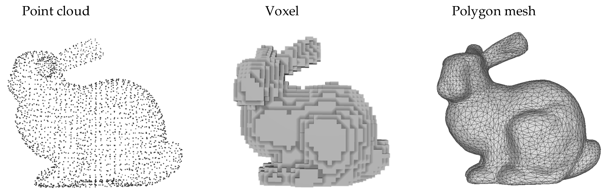

# Lesson 1 — What Is Gaussian Splatting and Why Should You Care

> **What you'll learn:** why storing the 3D world inside a computer is a problem nobody has properly solved yet, how the attempts evolved, and what the key idea behind Gaussian Splatting is.

---

## Why this matters

Let's start with an analogy.
You film a room on your phone. Regular photos from different angles. And then you want to "step inside" that room. Not a panorama. A full 3D scene. Rotate the camera, zoom in on objects, peek around corners where possible.

Gaussian Splatting does this. In real time.

Pretty quickly it went beyond being an academic toy. Novel view synthesis already works in production: virtual real estate tours, AR/VR content, museum visits. Any task where you need to "be" in a place that only exists as photographs — is a candidate.

But here's the general question: **how do you represent a three-dimensional world in computer memory so it can be quickly and beautifully shown from any viewpoint?**

That question is central to this entire course.

---

## The problem: how to "record" the 3D world

You photograph a cup — you get a grid of pixels. Two-dimensional. All the tools for 2D have been polished for years: load, process, display.

With 3D, things aren't that simple.

You have the real world — continuous, infinitely detailed, dependent on lighting and viewing angle. You need to store it as a finite set of numbers. Requirements:

1. **Storage** — reasonable (not terabytes per room)
2. **Rendering** — fast (30+ fps for VR/AR)
3. **Quality** — decent (not "a game from 2005")
4. **Learning from photos** — automatic (not manual work by a 3D artist)

No single approach wins on all four at once. But Gaussian Splatting got closer than anything else.

---

## Evolution: how we got to Gaussian Splatting

Let's walk through the main approaches for a general understanding. Maybe all this Gaussian Splatting stuff is pointless and there's no reason to study it at all.

### Polygonal meshes

The oldest method. Describe an object as a set of triangles. Each triangle — three vertices, a normal, a texture. The entire world of video games and cinema runs on this.

**Pros:**
- GPUs are built for triangle rasterization — rendering is instant
- Huge ecosystem (Blender, Maya, Unreal)
- Clear structure: vertices, edges, faces

**Cons:**
- Creation means manual work or expensive scanners
- Automatic reconstruction from photos produces rough, noisy meshes

Meshes work when a model is created by an artist and you need object interaction like in games. We want **automatic** reconstruction from photographs. And that's where problems start. Try automatically reconstructing a mesh of a lace curtain from five photos. You'll get a holey bedsheet with triangles sticking out everywhere. Beautiful. Neural networks are getting decent at this, but photorealism is still far away.

### Voxels

A 3D scene as a LEGO set. Split the space into identical cubes and for each one record: is there something here or is it empty, what color, what density. Minecraft is the most vivid and familiar example of this representation.

**Pros:**
- Conceptually simple: a 3D array of values
- Naturally processed by 3D convolutional networks
- No topology needed

**Cons:**
- Memory grows cubically: 512³ = 134 million voxels
- Details require high resolution → even more memory
- Not for photorealism tasks. A very rough object representation.

Voxels are like painting a picture with a palette knife. You'll capture general shapes. Fine details will require an unbearable number of strokes. Want to double the resolution along each axis — enjoy ×8 memory. Want to render a room with books on a shelf and a pattern on the carpet — you'll hit the GPU memory ceiling before you even start training.

### Point Clouds

The most "honest" 3D representation. A scanner or an algorithm (COLMAP, LiDAR) gives you millions of points with coordinates and color. No triangles, no topology — just a scatter of points in space.

**Pros:**
- Comes directly from real sensors like LiDAR and SfM pipelines. Pure math.
- No artificial topology — what you see is what you get
- Scales easily: more points = more detail. Relatively lightweight scenes even with millions of points.
- Convenient representation for technical tasks where accuracy matters (LiDAR). Millimeter precision.

**Cons:**
- Holes. Between points — nothing
- No surface: a point doesn't know which object it belongs to

The last downside is key for us. A point cloud is a great starting position (and 3DGS literally starts from one), but on its own it doesn't produce a smooth photorealistic render. Each point is an infinitely small thing with no size, shape, or transparency.

But what if you **gave each point a size, shape, color, and transparency**? What if instead of a point you placed a small semi-transparent ellipse that can be rotated, stretched, and recolored? Remember this thought — we'll come back to it in a couple of minutes.

### NeRF (Neural Radiance Fields)

In 2020, NeRF flipped the understanding of what you can extract from a few photographs. The idea is elegant: **the scene is a neural network**. Feed in a point coordinate (x, y, z) and a viewing direction — get color and density.

Rendering: cast rays from the camera through each pixel, query the network at hundreds of points along the ray, combine the results. You get a photograph.

**Pros:**
- Stunning quality on complex scenes
- Compact representation (weights of a single MLP)
- Learns from photographs + camera positions

**Cons:**
- Rendering is painfully slow: for a single pixel — dozens to hundreds of forward passes through an MLP
- Training takes hours
- The representation is **implicit**: you can't "touch" the scene

The last point is key. NeRF stores the scene as a black box. A neural network that answers the question "what color is here?". You can't look at the scene's structure, move an object, delete something. Everything is baked into the weights. Want to remove a chair from the room? Good luck — retrain the network from scratch.

### What about water, hair, cloth?

The industry has a whole zoo for that. Each of these approaches is a separate field with its own research. We won't dwell on them here.

### Summary

Meshes are fast but don't learn from photos. Voxels are simple but devour memory. Point clouds are a great raw foundation but have no surface. NeRF learns wonderfully but renders slowly and is opaque. Specialized methods solve narrow tasks.

We need an approach that takes the best of each: **learns from photos** (like NeRF), **renders in real time** (like mesh rasterization), and provides an **explicit representation** (like a point cloud — you can touch, move, delete things).

Such an approach exists. And it starts with the idea we already mentioned: take a point cloud and turn each point into a small, controllable, semi-transparent ellipsoid.

### Gaussian Splatting: when someone finally figured it out

2023. The paper by Kerbl et al. comes out — *"3D Gaussian Splatting for Real-Time Radiance Field Rendering"*. The idea:

**The scene is not a neural network. The scene is a cloud of gaussians.**

Each gaussian is an explicit object with specific parameters. You can take any one of them, see where it is, how big it is, what shape, what color. Move it. Delete it. Add a new one.

Imagine painting a picture — but instead of brushstrokes you use small colored clouds. Each cloud:

- Has a **center** — a point in space
- Has a **shape** — an elongated, flat, or round blob
- Has a **color** — any
- Has a **transparency** — from fully opaque to nearly invisible

You throw thousands of these clouds into space, and they overlap, mix, form objects. From far away — a photorealistic scene.

That's Gaussian Splatting. Each cloud is a **gaussian**.

Why "gaussian"? Because the intensity fades from center to edges following a Gaussian curve — that same "bell" from probability theory. Maximum at the center. Smooth fade to nothing at the edges. No sharp boundaries. The result looks smooth — gaussians blend into each other like watercolor spots.

---

## Anatomy of a single gaussian

Four properties. Pure intuition for now.

### Position (μ) — "Where am I?"

A point in 3D: three numbers (x, y, z). The center of the cloud — the point of maximum density.

The scene as a point cloud — gaussian positions are those points. The difference: each point isn't infinitely small, but "smeared" around its center. This is exactly how Gaussian Splatting initializes: it takes a point cloud from photogrammetry (COLMAP) and "fits" a gaussian onto each one. Dimensionless points become volumetric clouds.

### Shape (Σ) — "What do I look like?"

Covariance matrix. Don't be scared by the name — we'll break it down in lesson 2. For now the key thing: this thing defines the **size** and **orientation** of a gaussian.

Imagine a balloon:
- Inflate evenly → **sphere**
- Squeeze from the sides → **elongated ellipsoid** (like a melon)
- Rotate the melon at an angle → **oriented ellipsoid**

The covariance matrix encodes exactly this: stretch-compress along each axis plus rotation. One compact 3×3 matrix — and the gaussian takes any ellipsoidal shape.

This is more powerful than just a "radius". Gaussians flatten along a table surface (flat disks), stretch along a wall edge (cigar-shaped), or stay round (spheres). This flexibility allows describing the geometry of anything — from smooth walls to a shaggy carpet.

Looking ahead: in practice, the covariance matrix isn't stored as-is. It's decomposed into **rotation** (R) and **scale** (S): Σ = R·S·Sᵀ·Rᵀ. This guarantees physical correctness. But that's lesson 2 material — for now it's enough to understand: shape = size + orientation.

### Color (c) — "What color am I?"

Three numbers — RGB.

A nuance: in full GS, color depends on the viewing angle. A shiny sphere changes its tint as you walk around it — the highlight shifts. For this, **spherical harmonics (SH)** are used — functions that encode how color depends on direction. We'll cover this in lesson 7. For now, just consider: each gaussian has a color.

### Transparency (α) — "How visible am I?"

A number from 0 to 1. Zero — invisible. One — fully opaque.

Why? Gaussians **overlap**. A viewing ray passes through several of them, and the final pixel color is their combination. Opaque ones block what's behind them. Semi-transparent ones let light pass through.

A stack of colored glass: look through it — you see a mixed color. Each glass is partially transparent, the result depends on the order and transparency of each layer. This is **alpha compositing**. Details — in lesson 3.

---

## From one to a million: scale is everything

A single gaussian is a blurry spot. But if...

**~100 gaussians** — rough outlines. "There's probably a table here, and a wall there," but everything looks foggy. Impressionism: the mood is there, details aren't.

**~1,000** — shapes become recognizable. Contours are readable, colors are in place. Fine details — still blurry spots.

**~100,000** — almost a photograph. Wood texture, glass highlights, fabric folds. The working range for real scenes.

**1,000,000+** — photorealism. This is how many the original implementation uses for complex scenes: interiors, streets, architecture.

Important — even with a million gaussians, rendering works in real time. Each gaussian is not a neural network call but a simple operation: project the ellipsoid onto the screen, draw it. Modern GPUs do this in real time.

One more thing: gaussians are **adaptive in density**. In complex areas (fine details, textures) — many small ones. In simple areas (solid-color wall, sky) — few large ones. The model learns to distribute resources on its own. The adaptive density control mechanism — lesson 4.

---

## Why faster than NeRF: explicit vs. implicit

**NeRF** stores the scene **implicitly** — as a neural network. Want to know the color of a point? Run the coordinates through an MLP. One pixel? A hundred points along the ray, each through the MLP. An image at 1920×1080? Repeat millions of times. For **one frame**. What amazing efficiency.

**Gaussian Splatting** stores the scene **explicitly** — a set of objects with parameters. Rendering:

1. Take a gaussian
2. Project it onto the screen (a matrix operation)
3. Draw a semi-transparent ellipse
4. Blend overlapping ones

This is **rasterization**, not ray marching. GPUs can rasterize billions of primitives per second. That's literally what they were built for.

Numbers: NeRF renders a frame in seconds to minutes. Gaussian Splatting — **100+ fps** at the same quality. The difference between a slideshow and reality.

### Comparison of approaches

| | Meshes | Voxels | Point Cloud | NeRF | Gaussian Splatting |
|---|---|---|---|---|---|
| **Representation** | Triangles | 3D grid | Points (x, y, z) | Neural network (implicit) | Gaussians (explicit) |
| **Rendering** | Instant | Medium | Full of holes | Very slow | Instant |
| **Quality** | Depends on model | Limited by resolution | Low without processing | High | High |
| **Learning from photos** | Poor | Poor | Good (SfM) | Excellent | Excellent |
| **Editability** | Excellent | Good | Good | Poor | Good |
| **Memory** | Moderate | A lot (cubically) | Moderate | Low | A lot |
| **Water, hair, cloth** | Specialized methods | No | No | Learns appearance, not physics | Open problem |

No approach is perfect. But Gaussian Splatting was the first to combine **NeRF-level quality** with **rasterization speed**, while keeping an **explicit representation** — every gaussian can be touched, moved, deleted. This combination is what made it the breakthrough of 2023.

---

## How it trains: the big picture

We'll go into detail in lesson 4. But the general idea is needed now — it explains why this even works.

You have 50 photographs of a room from known viewpoints. You want a set of gaussians that, when rendered from those viewpoints, produce **the exact same photographs**.

The process:

1. **Initialization.** An initial point cloud (from COLMAP or random). Each point gets a gaussian with random parameters.
2. **Rendering.** Pick a training viewpoint, render the scene.
3. **Comparison.** Loss — how much the render differs from the real photograph.
4. **Update.** Gradient descent adjusts the parameters: positions, shapes, colors, opacities.
5. **Repeat** thousands of times until renders become indistinguishable from photographs.

The entire process is **differentiable**. That's the key word. The gradient of the loss with respect to every parameter of every gaussian → update via PyTorch autograd. No manual tuning. The model learns on its own.

And one more thing: during training, the model doesn't just move existing gaussians. It **creates new ones** (where details are missing) and **deletes unnecessary ones** (too transparent, too large). The mechanism is **adaptive density control**. It's critical for quality. Lesson 4.

---

## Pitfalls

Before you rush to implement — some warnings. We'll return to each in later lessons. But you should know from day one.

- **Memory.** A million gaussians × (position + shape + color + transparency) = gigabytes per scene. Significantly more than MLP weights in NeRF. Compression is an active research area. And a topic I'm working on right now.

- **Floaters.** The camera looks somewhere that wasn't in the training photos — artifacts appear, "ghosts." Meaningless semi-transparent blobs floating in mid-air. The model didn't know what was there and filled the void with garbage. Looks like an LLM hallucination, but in 3D.

- **Initialization.** GS usually starts from a point cloud generated by COLMAP (Structure from Motion). The quality of the initial cloud is critical. Few photos → few starting points → poor foundation. Garbage in — garbage out. A classic. This problem is also being solved, and there are works that can produce good results from a small number of cameras.

- **Dynamics.** The base method is designed for static scenes. For video, extensions are needed — 4D gaussians. Lessons 10–13.

---

## Summary

- **3D scene representation** is a fundamental CV task. Meshes, voxels, NeRF, point clouds — each has its strengths and weaknesses.

- **Gaussian Splatting** represents a scene as a cloud of thousands to millions of gaussians — explicit "blurry drops of paint" in 3D.

- Each gaussian: **position** (μ), **shape** (Σ), **color** (c), **transparency** (α).

- An **explicit representation** is fundamentally faster than an **implicit** one — rendering comes down to rasterization, not millions of forward passes.

- Quality on par with NeRF at **100+ fps**. A breakthrough that paved the way for real-time novel view synthesis.

---

Now you know **what** a gaussian is and **why** Gaussian Splatting matters. In lesson 2 — we'll break down the math: where the "bell" comes from, what the covariance matrix encodes, and you'll create your first gaussian by hand. With actual numbers.
