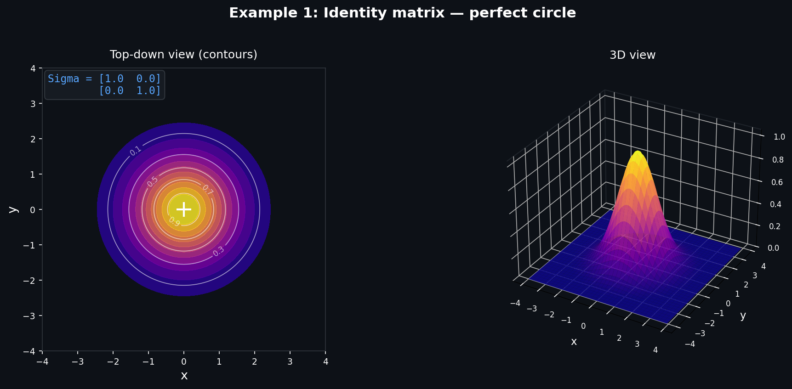
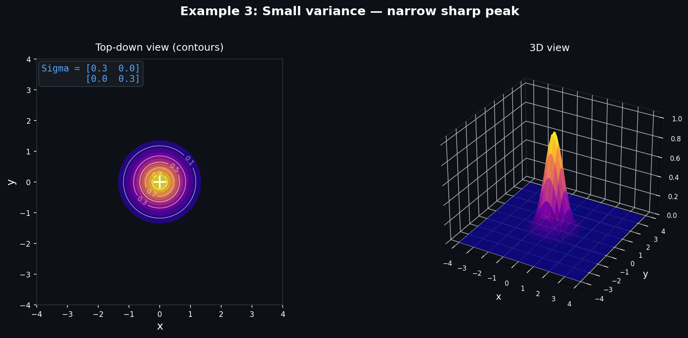
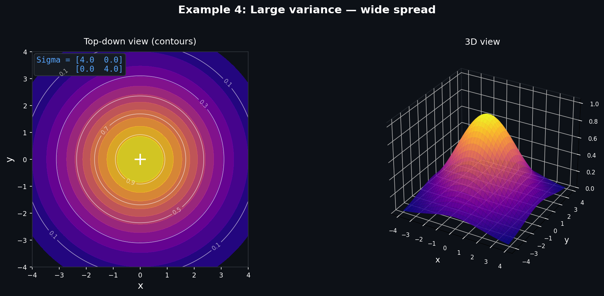
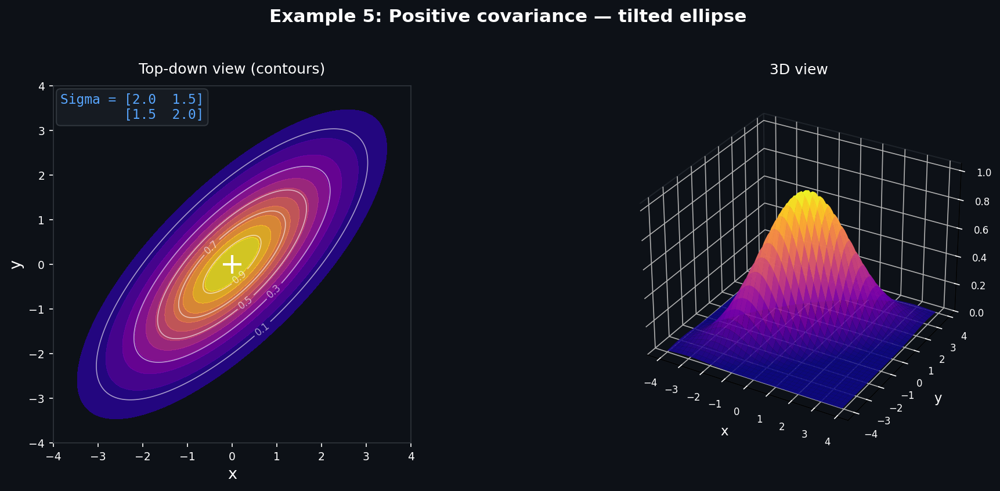
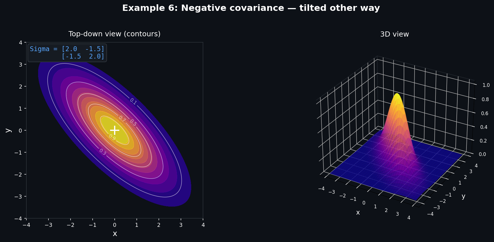
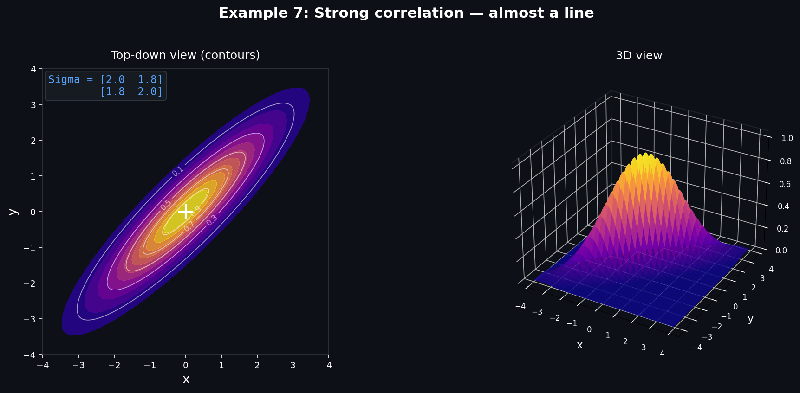
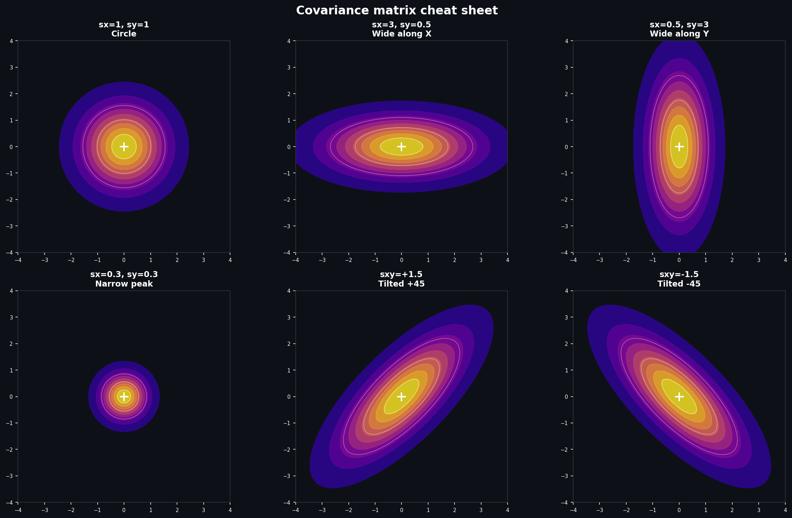
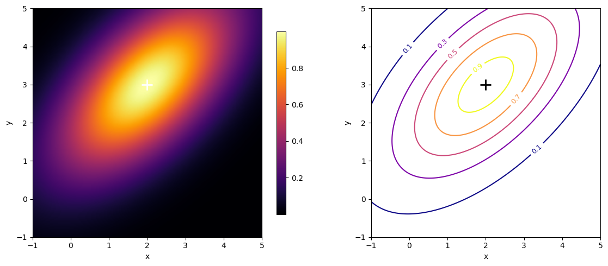

# Lesson 2 — The Math Behind a Gaussian: Breaking It Down Piece by Piece

> **What you'll learn:** where the "bell" of the normal distribution comes from and what
> each symbol in its formula means, how a gaussian extends from 1D to 2D and
> 3D, what the covariance matrix Σ actually encodes, and why it's decomposed
> into rotation and scale. And at the end — you'll create your first gaussian by hand
> and see the result in PyTorch.

---

## Why this matters

In lesson 1 we talked about a gaussian intuitively: a "blurry drop of paint" with
position, shape, color, and transparency. That was enough to grasp the idea.
But to actually **implement** Gaussian Splatting — you need to understand the math.

There won't be any theorem proofs or abstract reasoning here. We'll
take the engineering path: start with the simplest case (1D), break down every
symbol, then extend to 2D and 3D. And at the end — we'll manually compute a specific
gaussian and draw it in code.

After this lesson, you'll be able to take any gaussian from a trained model, look
at its parameters — and know exactly what you're seeing: where it is, what shape it has,
which direction it's stretched in.

---

## Starting with 1D: the familiar bell

You've almost certainly seen the bell-shaped curve — the normal distribution. This is
the foundation everything else is built on. Let's break the formula down symbol by
symbol.

A one-dimensional gaussian is defined as:

$$
f(x) = \exp\left(-\frac{(x - \mu)^2}{2\sigma^2}\right)
$$

Three elements — each doing its own job:

- **x** — the point where we compute the value. Plug in a coordinate —
  get a number from 0 to 1.

- **μ** (mu) — the center of the bell. This is the point where the value is maximum (equal to 1).
  Shift μ — the entire bell shifts.

- **σ** (sigma) — the standard deviation. Determines the **width** of the bell.
  Small σ — narrow, sharp peak. Large σ — wide, gentle hill.

Notice: the normalizing factor $\frac{1}{\sigma\sqrt{2\pi}}$ is absent here.
In Gaussian Splatting we don't need the area under the curve to equal one — we use
the gaussian as a **weight function**, not as a probability distribution. The value
at the center is always 1, and it decays exponentially towards the edges.

Let's feel this with numbers. Take μ = 0 and σ = 1:

| x | (x − μ)² / 2σ² | f(x) |
|---|-----------------|------|
| 0 | 0 | 1.000 |
| 1 | 0.5 | 0.607 |
| 2 | 2.0 | 0.135 |
| 3 | 4.5 | 0.011 |

This exponential decay is the key property of a gaussian.

A real-life analogy: imagine a flashlight pointed at a wall. At the center of the
spot — maximum brightness. Closer to the edges — it gradually dims. At some distance
the light is indistinguishable from the background. That's how a gaussian works:
maximum at center μ, width determined by σ, and beyond 3σ — practically zero.

In practice this matters for rendering: we don't need to compute the contribution of
every gaussian for every pixel. If a pixel is farther than 3σ from the center —
the contribution is negligibly small, we can skip it. This is a massive savings: instead
of checking a million gaussians for each of two million pixels, we only check
the nearby ones. This locality is exactly what makes Gaussian Splatting so fast.

---

## From 1D to 2D: enter the covariance matrix

In the one-dimensional case, shape is defined by a single number — σ. But gaussians in
Gaussian Splatting live in space, not on a line. We need a second dimension.

The naive approach — take two separate σ for the x and y axes:

$$
f(x, y) = \exp\left(-\frac{1}{2}\left[\frac{(x - \mu_x)^2}{\sigma_x^2} + \frac{(y - \mu_y)^2}{\sigma_y^2}\right]\right)
$$

This works — but only for ellipses **aligned with the coordinate axes**.
Want it at 45°? Can't do it. And in real scenes, gaussians are rotated
arbitrarily: along a wall, diagonally across a roof, at an angle to the floor.

## Covariance matrix: chewing it to bits

This is where the **covariance matrix** Σ comes in. It generalizes "width" to
any number of dimensions and arbitrary orientations.

A 2D gaussian with a covariance matrix:

$$
f(\mathbf{x}) = \exp\left(-\frac{1}{2}(\mathbf{x} - \boldsymbol{\mu})^\top \Sigma^{-1} (\mathbf{x} - \boldsymbol{\mu})\right)
$$

Let's break it apart:

- **x** — now a vector (x, y), a point on a plane
- **μ** — also a vector ($μ_x$, $μ_y$), the center of the gaussian
- **(x − μ)** — the vector from center to point
- **Σ⁻¹** — the inverse covariance matrix (2×2)
- **(x − μ)ᵀ Σ⁻¹ (x − μ)** — a quadratic form: a single number that
  determines the "distance" from the center accounting for the ellipse's shape

### What is the covariance matrix

Σ is a 2×2 matrix (in 2D) or 3×3 (in 3D) that fully defines the **shape** of a gaussian:

$$
\Sigma = \begin{pmatrix} \sigma_{xx} & \sigma_{xy} \\\\ \sigma_{xy} & \sigma_{yy} \end{pmatrix}
$$

Four numbers. But the matrix is **symmetric** (upper right = lower left),
so there are only three unique numbers. Each one is responsible for a specific thing:

- **$σ_{xx}$** (upper left) — variance along the X axis. How much the gaussian
  is "spread" horizontally.
- **$σ_{yy}$** (lower right) — variance along the Y axis. How much it's "spread"
  vertically.
- **$σ_{xy}$** (both off-diagonal) — covariance. The link between axes.
  Determines the **tilt** of the ellipse.

Analogy: $σ_{xx}$ and $σ_{yy}$ are the lengths of a balloon's axes. $σ_{xy}$ is the angle
you've rotated it to.

Let's look at examples.

---

### Example 1: Identity matrix — a perfect circle

$$
\Sigma = \begin{pmatrix} 1 & 0 \\\\ 0 & 1 \end{pmatrix}
$$

Variance is the same along both axes (1 and 1). Covariance = 0 (no tilt).
The result — a **perfect circle**. The gaussian is "spread" equally
in all directions, like a drop of water on glass.

This is the starting point. Identity matrix = "nothing special going on."
Everything is symmetric, nothing is rotated.



---

### Example 2: Different variances — axis-aligned ellipse

$$
\Sigma = \begin{pmatrix} 3 & 0 \\\\ 0 & 0.5 \end{pmatrix}
$$

$σ_{xx}$ = 3 (wide along X), $σ_{yy}$ = 0.5 (narrow along Y). Covariance = 0.

The result — an **ellipse stretched horizontally**. A large number on the diagonal =
the gaussian has "spread out" in that direction. A small number = it's "compressed."

Imagine: take that round balloon from example 1 and squeeze it from top and
bottom. It flattens sideways — you get a pancake.

Now look at the 3D plot on the right: the peak height is the same (1.0 at center),
but the "hill" has become wide and flat along X and narrow along Y. Like a mountain ridge.


---

### Example 3: Small variance — sharp peak

$$
\Sigma = \begin{pmatrix} 0.3 & 0 \\\\ 0 & 0.3 \end{pmatrix}
$$

Both variances are small. The gaussian is **very narrow** — almost a point. The value
drops off rapidly from the center. Already at distance ~1 from center — practically zero.

In Gaussian Splatting, gaussians like these handle **fine details**: sharp
corners, thin lines, textures. The finer the detail — the smaller the σ.



---

### Example 4: Large variance — wide spread

$$
\Sigma = \begin{pmatrix} 4 & 0 \\\\ 0 & 4 \end{pmatrix}
$$

Both variances are large. The gaussian is **spread** over a large area.
A smooth, gentle hill.

In GS, gaussians like these cover **uniform regions**: walls, sky, floor.
One large gaussian replaces many small ones, so the model saves resources.

Compare with example 3: there the peak is sharp as a needle, here — gentle as a hill.
Both are round ($σ_{xx}$ = $σ_{yy}$), but the scale is completely different.



---

### Example 5: Positive covariance — tilt

$$
\Sigma = \begin{pmatrix} 2 & 1.5 \\\\ 1.5 & 2 \end{pmatrix}
$$

Here's where it gets interesting. The variances are the same (2 and 2),
but $σ_{xy} = 1.5$. **The ellipse has rotated by ~45°**.

What does positive covariance mean? When x grows — y tends to grow too.
The gaussian is "stretched" along the direction x = y (the diagonal from lower-left
to upper-right).

Physical analogy: put a sausage on a table and rotate it clockwise
by 45°. That's what positive covariance does.



---

### Example 6: Negative covariance — tilt the other way

$$
\Sigma = \begin{pmatrix} 2 & -1.5 \\\\ -1.5 & 2 \end{pmatrix}
$$

Same thing, but $σ_{xy} = −1.5$. The ellipse is tilted **the other way** —
along the direction $x = −y$.

Negative covariance: when x grows — y decreases. A mirror image of
example 5.

The sign of the covariance = the direction of the tilt. Plus — up-right. Minus —
down-right.



---

### Example 7: Strong correlation — almost a line

$$
\Sigma = \begin{pmatrix} 2 & 1.8 \\\\ 1.8 & 2 \end{pmatrix}
$$

Covariance $σ_{xy} = 1.8$, with variances of 2. This is very close to the maximum
(at $σ_{xy} = 2$ the matrix would become singular — determinant = 0).

The result — a **highly elongated ellipse**, almost turning into a line.

Why does this matter for GS? Such "cigar-shaped" gaussians describe
**thin structures**: wires, object edges, tree branches. The model
learns to stretch gaussians along thin lines in the scene.

Constraint: $σ_{xy}²$ must be **strictly less** than $σ_{xx}$ · $σ_{yy}$. Otherwise
the matrix ceases to be positive definite (loses physical meaning — you can't
describe such a shape as an ellipse). This is one of the reasons why in GS
the covariance matrix is parameterized through R and S rather than stored directly —
the decomposition Σ = R·S·Sᵀ·Rᵀ **guarantees** positive definiteness.



---

### Cheat sheet: all cases side by side



---

### Covariance matrix summary

Three numbers — three degrees of freedom:

| Parameter | What it does | Analogy |
|----------|-----------|----------|
| **$σ_{xx}$** | Width along X | Stretching the balloon horizontally |
| **$σ_{yy}$** | Width along Y | Stretching the balloon vertically |
| **$σ_{xy}$** | Tilt/rotation | Rotating the balloon around its center |

Rules:
- $σ_{xx} = σ_{yy}$ and $σ_{xy}$ = 0 → **circle**
- $σ_{xx} ≠ σ_{yy}$ and $σ_{xy}$ = 0 → **axis-aligned ellipse** (horizontal or vertical)
- $σ_{xy} ≠ 0$ → **rotated ellipse** (direction depends on the sign)
- |$σ_{xy}$| close to √($σ_{xx}$ · $σ_{yy}$) → **highly elongated** (almost a line)

In 3D it's all the same, only the matrix is 3×3 and there are six unique numbers
(three variances + three covariances). The ellipse becomes an ellipsoid.
Three axes instead of two. Three possible rotations instead of one. The principle
doesn't change.

---

## From 2D to 3D: the same logic

Good news: the transition from 2D to 3D is purely mechanical. The formula stays the same,
only the dimensions grow:

$$
f(\mathbf{x}) = \exp\left(-\frac{1}{2}(\mathbf{x} - \boldsymbol{\mu})^\top \Sigma^{-1} (\mathbf{x} - \boldsymbol{\mu})\right)
$$

The exact same formula. Only now:

- **x** = (x, y, z) — a point in 3D
- **μ** = ($μ_x$, $μ_y$, $μ_z$) — the gaussian's center in 3D
- **Σ** — a 3×3 matrix

$$
\Sigma = \begin{pmatrix} \sigma_{xx} & \sigma_{xy} & \sigma_{xz} \\\\ \sigma_{xy} & \sigma_{yy} & \sigma_{yz} \\\\ \sigma_{xz} & \sigma_{yz} & \sigma_{zz} \end{pmatrix}
$$

The ellipse turns into an **ellipsoid** — a three-dimensional "melon" of arbitrary shape and
orientation. Six independent parameters (the matrix is symmetric: $σ_{xy} = σ_{yx}$ and
so on) define:

- Three sizes (along each of the ellipsoid's principal axes)
- Three orientation angles in space

Important: the gaussian formula is **the same** in 1D, 2D, and 3D. Only
the dimensionality of vectors and the matrix changes. This unification is one of the
reasons why gaussians are so convenient as primitives: the same code works in any
number of dimensions.

---

## Mean = position: the simplest parameter

The center μ is just a point in space. Three numbers: (x, y, z). Simply **where**
the gaussian is located.

Recall lesson 1: when Gaussian Splatting initializes from a point cloud, gaussian positions = point positions. Then during training, each μ
gets adjusted by gradient descent. The gaussian literally "crawls" to where
it needs to be.

No tricky math here. But there's an important consequence: **μ is the
position to which the entire shape is anchored**. Move μ — the whole
"drop" moves with it, along with all its shape and orientation.

---

## The decomposition Σ = R·S·Sᵀ·Rᵀ — why and how

A covariance matrix can't be arbitrary. It must be:

1. **Symmetric** (Σ = Σᵀ)
2. **Positive semi-definite** (all eigenvalues ≥ 0)

If these conditions are violated — the gaussian loses physical meaning. Negative
"widths" don't exist.

The problem: during training, PyTorch updates parameters via gradient descent.
If you store Σ directly and optimize its elements — nothing guarantees that
after an update it will remain positive semi-definite. At some iteration
Σ might "break" — and everything goes haywire.

The solution: **don't store Σ directly**. Instead — store two other objects:

- **S** — scale matrix (diagonal matrix, three numbers: $s_x$, $s_y$, $s_z$)
- **R** — rotation matrix

And **compute** the covariance matrix from them:

$$
\Sigma = R \cdot S \cdot S^\top \cdot R^\top
$$

Why does this work? Because with this decomposition, Σ **automatically**
turns out symmetric and positive semi-definite — for **any** values of
S and R. Optimize S and R however you want — Σ will always be valid. No
extra constraints, no "clamping" — the guarantee comes for free.

Let's break down each component.

### S — scale

A diagonal matrix:

$$
S = \begin{pmatrix} s_x & 0 & 0 \\\\ 0 & s_y & 0 \\\\ 0 & 0 & s_z \end{pmatrix}
$$

Three numbers — three scales along each axis. In practice they're stored as a vector
($s_x$, $s_y$, $s_z$). The matrix S·Sᵀ is a diagonal matrix with elements
($s_x²$, $s_y²$, $s_z²$):

$$
S \cdot S^\top = \begin{pmatrix} s_x^2 & 0 & 0 \\\\ 0 & s_y^2 & 0 \\\\ 0 & 0 & s_z^2 \end{pmatrix}
$$

These are the "variances" along each axis **before rotation**. If $s_x$ > $s_y$ > $s_z$ —
the gaussian is stretched along x, flat along z. If all three are equal — a perfect
sphere.

### R — rotation

In practice, R is defined through a **quaternion** q = (w, x, y, z) — four numbers with
the constraint ||q|| = 1.

A **quaternion** is a set of four numbers (w, x, y, z) that describes a rotation
in 3D space. One number (w) encodes the rotation angle, three numbers
(x, y, z) encode the axis around which the rotation occurs. The constraint
$w^2 + x^2 + y^2 + z^2 = 1$ guarantees that this is purely a rotation,
not a rotation + scaling.

Essentially — a compact way to pack the answer to "around which axis and by
how many degrees to rotate the object," without the gimbal lock problems that
come with Euler angles.

> **For the curious:** mathematically, a quaternion is a hypercomplex number,
> an extension of complex numbers to four dimensions. Proposed by Hamilton
> in 1843. A complex number $a + bi$ describes rotations on a plane
> (2D). A quaternion $a + bi + cj + dk$ does the same for 3D. If
> you want to dig deeper — 3Blue1Brown has an excellent video
> "Visualizing quaternions." For working with GS, this isn't needed.

But first — why? Why not just store three angles?

### Why Euler angles don't work

The most intuitive way to define a rotation — **Euler angles**: three angles,
each responsible for rotation around one axis. Rotate 30° around X,
then 45° around Y, then 10° around Z. Three numbers, clear, compact.

The problem is called **gimbal lock**. The idea is simple: at certain
angle combinations, two rotation axes **align**, and you lose one
degree of freedom. There were three independent rotation directions — now there are two.

A concrete example: if the second angle (around Y) equals exactly 90°, then
rotations around X and Z start doing **the same thing** —
spinning the object in one plane. You're specifying three different numbers,
but the actual rotation directions are two. The third one is "stuck."

For Gaussian Splatting this means: at certain gaussian orientations,
the gradient **doesn't know** how to rotate it in the needed direction.
Optimization gets stuck or jitters. The model wants to rotate a gaussian
by 1° in a specific direction, but Euler angles at that point can't
express it — because two axes have merged.

> If you want to see gimbal lock with your own eyes — google "gimbal lock
> animation." One 30-second animation explains it better than any text.

### Quaternion: four numbers instead of three

A quaternion encodes rotation differently: not "three sequential rotations
around axes," but **a single rotation around an arbitrary axis by a given angle**.

The formula for constructing a quaternion from an axis and angle:

$$
q = \left(\cos\frac{\theta}{2},\quad a_x \cdot \sin\frac{\theta}{2},\quad a_y \cdot \sin\frac{\theta}{2},\quad a_z \cdot \sin\frac{\theta}{2}\right)
$$

where θ is the rotation angle, and $(a_x, a_y, a_z)$ is the unit vector of the rotation axis.

That is:

- **w** = cos(half the angle) — encodes **how much** to rotate
- **(x, y, z)** = rotation axis × sin(half the angle) — encodes **what to rotate around**

Why θ/2 and not θ? It's a property of quaternion math — rotation
"wraps around" twice. For working with GS this doesn't matter: PyTorch optimizes
the four numbers directly and doesn't care why there's a half in there.

Why four numbers and not three? Because three numbers are **mathematically unable**
to smoothly describe all possible rotations in 3D. The fourth number is the price
for gimbal lock never occurring, at any orientation.

Why this matters for GS:

1. **No gimbal lock** — optimization doesn't get stuck at any
   gaussian orientation.
2. **Smooth gradients** — a small change in the quaternion = a small
   rotation. No jumps, no discontinuities. PyTorch optimizes happily.

### Concrete examples

Let's plug in numbers — it'll become clearer.

**90° rotation around the Z axis.**
Angle θ = 90°, θ/2 = 45°. Axis = (0, 0, 1) — pure Z.

$$
q = (\cos 45°,\; 0 \cdot \sin 45°,\; 0 \cdot \sin 45°,\; 1 \cdot \sin 45°) = (0.707,\; 0,\; 0,\; 0.707)
$$

The x and y components = 0, because the rotation axis has no components along X and Y.
Only z "survives."

**90° rotation around the X axis.**
Axis = (1, 0, 0). Now sin(45°) lands in x:

$$
q = (0.707,\; 0.707,\; 0,\; 0)
$$

**180° rotation around Z.**
θ/2 = 90°. cos(90°) = 0, sin(90°) = 1:

$$
q = (0,\; 0,\; 0,\; 1)
$$

w = 0. The entire quaternion has "gone" into the axis.

**No rotation (θ = 0°).**
cos(0°) = 1, sin(0°) = 0:

$$
q = (1,\; 0,\; 0,\; 0)
$$

The identity quaternion — nothing is rotated. The starting position.

### How the quaternion becomes a matrix

From a quaternion q = (w, x, y, z) the rotation matrix R (3×3) is computed as:

$$
R = \begin{pmatrix} 1 - 2(y^2 + z^2) & 2(xy - wz) & 2(xz + wy) \\\\ 2(xy + wz) & 1 - 2(x^2 + z^2) & 2(yz - wx) \\\\ 2(xz - wy) & 2(yz + wx) & 1 - 2(x^2 + y^2) \end{pmatrix}
$$

Looks scary. No need to memorize it. Let's plug in numbers from the first example.

**Example:** q = (0.707, 0, 0, 0.707) — 90° rotation around Z.

Substituting w = 0.707, x = 0, y = 0, z = 0.707:

$$
R = \begin{pmatrix} 0 & -1 & 0 \\\\ 1 & 0 & 0 \\\\ 0 & 0 & 1 \end{pmatrix}
$$

Look at the third row and third column: (0, 0, 1). The Z axis is untouched.
Makes sense — we were rotating around Z, so Z stays in place. And in the upper-left
2×2 block — that same 90° rotation matrix on a plane that you already saw
in the 2D examples.

In the 3DGS code this is a single function, ~5 lines of PyTorch. You specify four
quaternion numbers, get a matrix R (3×3), then Σ = R·S·Sᵀ·Rᵀ. Gradients —
PyTorch computes them automatically.

For understanding GS you need to remember one thing: **a quaternion is four numbers
that define a rotation, and PyTorch optimizes them**.

### The full picture

Putting it together:

1. S·Sᵀ — creates a "bare" ellipsoid, stretched along the coordinate axes
2. R·(...)·Rᵀ — rotates this ellipsoid into the desired orientation

The result: an **arbitrary ellipsoid** in 3D — any size, any orientation.
And Σ is **guaranteed to be valid**.

Instead of optimizing 6 matrix elements (and praying it doesn't "break"), we optimize 7
intuitive parameters: 3 scales + 4 quaternion components.

---

## Hands-on example: creating a gaussian with concrete numbers

Enough abstractions — let's compute. We'll create a 2D gaussian (so it can be
drawn on paper) and walk through the entire path: from parameters to the covariance
matrix.

> **Note:** we're working in 2D, so there are no quaternions here.
> In 2D, rotation is defined by a single angle θ, and the rotation matrix is a simple 2×2
> using sin and cos. Gimbal lock doesn't exist in 2D — there's only one rotation axis,
> nothing to "merge." Quaternions will only be needed in 3D, when we
> move on to actual Gaussian Splatting.

### Step 1: define the parameters

Center:

$$
\mu = (2, 3)
$$

Scale — the gaussian is stretched along the first axis by a factor of two:

$$
s_x = 2, \quad s_y = 1
$$

Rotation angle — 45° (π/4). In 2D the rotation matrix:

$$
R = \begin{pmatrix} \cos 45° & -\sin 45° \\\\ \sin 45° & \cos 45° \end{pmatrix} = \begin{pmatrix} 0.707 & -0.707 \\\\ 0.707 & 0.707 \end{pmatrix}
$$

### Step 2: build S·Sᵀ

$$
S \cdot S^\top = \begin{pmatrix} 2^2 & 0 \\\\ 0 & 1^2 \end{pmatrix} = \begin{pmatrix} 4 & 0 \\\\ 0 & 1 \end{pmatrix}
$$

This is the ellipse before rotation: stretched along the x axis (width 4), normal along y (width 1).

### Step 3: compute Σ = R·S·Sᵀ·Rᵀ

First R · S·Sᵀ:

$$
R \cdot (S \cdot S^\top) = \begin{pmatrix} 0.707 & -0.707 \\\\ 0.707 & 0.707 \end{pmatrix} \begin{pmatrix} 4 & 0 \\\\ 0 & 1 \end{pmatrix} = \begin{pmatrix} 2.828 & -0.707 \\\\ 2.828 & 0.707 \end{pmatrix}
$$

Now multiply by Rᵀ:

$$
\Sigma = \begin{pmatrix} 2.828 & -0.707 \\\\ 2.828 & 0.707 \end{pmatrix} \begin{pmatrix} 0.707 & 0.707 \\\\ -0.707 & 0.707 \end{pmatrix} = \begin{pmatrix} 2.5 & 1.5 \\\\ 1.5 & 2.5 \end{pmatrix}
$$

### Step 4: read the result

$$
\Sigma = \begin{pmatrix} 2.5 & 1.5 \\\\ 1.5 & 2.5 \end{pmatrix}
$$

What do we see?

- **Diagonal** (2.5, 2.5) — variances along the x and y axes are **equal**. But that
  doesn't mean the ellipse is circular! Covariance ≠ 0 makes it tilted.
- **Covariance** (1.5) — positive, meaning the x and y axes are **positively
  correlated**: the ellipse is tilted in the direction "from lower-left to
  upper-right" — exactly at 45°, just as we specified.

Let's verify: the eigenvalues of Σ are λ₁ = 4, λ₂ = 1 — exactly the squares of our
scales $s_x²$ and $s_y²$. Everything checks out.

### Step 5: compute the value at a specific point

Take the point (3, 4) — one unit to the right and above the center.

$$
\mathbf{x} - \boldsymbol{\mu} = (3 - 2, \; 4 - 3) = (1, 1)
$$

To compute the quadratic form we need Σ⁻¹. For a 2×2 matrix:

$$
\Sigma^{-1} = \frac{1}{\det \Sigma} \begin{pmatrix} 2.5 & -1.5 \\\\ -1.5 & 2.5 \end{pmatrix}
$$

$$
\det \Sigma = 2.5 \cdot 2.5 - 1.5 \cdot 1.5 = 6.25 - 2.25 = 4.0
$$

$$
\Sigma^{-1} = \begin{pmatrix} 0.625 & -0.375 \\\\ -0.375 & 0.625 \end{pmatrix}
$$

Quadratic form:

$$
(\mathbf{x} - \boldsymbol{\mu})^\top \Sigma^{-1} (\mathbf{x} - \boldsymbol{\mu}) = (1, 1) \begin{pmatrix} 0.625 & -0.375 \\\\ -0.375 & 0.625 \end{pmatrix} \begin{pmatrix} 1 \\\\ 1 \end{pmatrix}
$$

$$
= (1, 1) \begin{pmatrix} 0.25 \\\\ 0.25 \end{pmatrix} = 0.5
$$

Final result:

$$
f(3, 4) = \exp\left(-\frac{0.5}{2}\right) = \exp(-0.25) \approx 0.779
$$

The point (3, 4) lies **along the principal axis** of the ellipse (in the rotation direction),
so the value is high — 0.779. If we had taken a point across the principal axis
(e.g., (3, 2)), the value would be significantly lower — the ellipse is narrow
in that direction.

---

## Code: creating and visualizing a 2D gaussian in PyTorch

Time to translate math into code. We'll create the same gaussian we computed
by hand, and draw it.

```python
import torch
import matplotlib.pyplot as plt

mu = torch.tensor([2.0, 3.0]) # center (position)
scales = torch.tensor([2.0, 1.0]) # scales
ANGLE_DEG = 45.0 # rotation angle, degrees

# Rotation matrix R
theta = torch.deg2rad(torch.tensor(ANGLE_DEG))
R = torch.tensor([
    [torch.cos(theta), -torch.sin(theta)],
    [torch.sin(theta),  torch.cos(theta)],
])

# Scale matrix S
S = torch.diag(scales) # [[s_x, 0], [0, s_y]]

# Covariance matrix
cov = R @ S @ S.T @ R.T
print("Σ =\n", cov)
# Expected: [[2.5, 1.5], [1.5, 2.5]]
```

First block: we defined parameters and got Σ. Check — the numbers match our
manual calculation.

```python
# Compute gaussian values on a grid of points
GRID_SIZE = 200
GRID_RANGE = 6.0 # from -1 to 5 along each axis

# Coordinate grid
lin = torch.linspace(mu[0] - GRID_RANGE/2, mu[0] + GRID_RANGE/2, GRID_SIZE)
x_grid, y_grid = torch.meshgrid(lin, lin, indexing="xy")

# Each grid point is a vector (x, y), forming a matrix [N*N, 2]
points = torch.stack([x_grid, y_grid], dim=-1) # [200, 200, 2]

# Offset from center
diff = points - mu # [200, 200, 2]

# Quadratic form
cov_inv = torch.linalg.inv(cov)

mahal = torch.einsum("...i,ij,...j->...", diff, cov_inv, diff)

# Gaussian value
gaussian = torch.exp(-0.5 * mahal) # [200, 200]
```

Second block: we created a grid of points and computed the gaussian value at each one.
The key line is `einsum`: it computes the quadratic form (Mahalanobis distance)
for all points at once, without loops.

```python
# Visualization
fig, axes = plt.subplots(1, 2, figsize=(12, 5))

# Heatmap
im = axes[0].imshow(
    gaussian, origin="lower", cmap="inferno",
    extent=[lin[0], lin[-1], lin[0], lin[-1]],
)
axes[0].plot(*mu, "w+", markersize=15, markeredgewidth=2)
axes[0].set_title("Heatmap (gaussian value)")
axes[0].set_xlabel("x")
axes[0].set_ylabel("y")
plt.colorbar(im, ax=axes[0], shrink=0.8)

# Contours
CONTOUR_LEVELS = [0.1, 0.3, 0.5, 0.7, 0.9]
cs = axes[1].contour(
    x_grid.numpy(), y_grid.numpy(), gaussian.numpy(),
    levels=CONTOUR_LEVELS, cmap="plasma",
)
axes[1].clabel(cs, inline=True, fontsize=9)
axes[1].plot(*mu, "k+", markersize=15, markeredgewidth=2)
axes[1].set_title("Contours (isolines = ellipses)")
axes[1].set_xlabel("x")
axes[1].set_ylabel("y")
axes[1].set_aspect("equal")

plt.tight_layout()
plt.show()
```

Third block: visualization. Two plots:



- **Left** — heatmap: brightness = gaussian value. You can see that the
  maximum (white) is at center (2, 3), and the "spot" is stretched at 45°.
- **Right** — contour lines. Each line represents points with the same value.
  These are the **ellipses**, whose shape is determined by the covariance matrix.

The white cross marks the center μ. Notice: the ellipses are indeed tilted
at 45°, stretched in the "lower-left to upper-right" direction — exactly
as we calculated.

---

## Experiment: change parameters — see the result

Try changing parameters and rerunning the code — here's what will happen:

| What to change | How to change it | What you'll see |
|---|---|---|
| `scales = [2.0, 1.0]` → `[1.0, 1.0]` | Equal scales | Circle instead of ellipse |
| `scales = [2.0, 1.0]` → `[3.0, 0.5]` | Stretch more | Thin long "cigar" |
| `ANGLE_DEG = 45` → `0` | Remove rotation | Ellipse along the x axis |
| `ANGLE_DEG = 45` → `90` | Rotate 90° | Ellipse along the y axis |
| `mu = [2, 3]` → `[0, 0]` | Shift center | Same shape, different location |

Each parameter affects something specific: scale — "compression/stretching,"
angle — orientation, μ — position. The covariance matrix Σ packs scale
and rotation into a single structure.

This is the essence of gaussian parameterization: **divide and conquer**. Instead of one
opaque matrix — two intuitive components. Want to make a gaussian
thicker? Increase the scale. Want to rotate it? Turn the quaternion. Want to
move it? Shift μ. Everything is orthogonal, everything is predictable — and gradient
descent loves that.

---

## Summary

- **1D gaussian** — a bell, defined by center μ and width σ. The value decays
  exponentially: beyond 3σ — practically zero.

- **2D and 3D gaussians** — the same formula, but instead of scalar σ we get a
  **covariance matrix Σ**, which defines the ellipse/ellipsoid shape: size
  along each axis + orientation.

- **μ** — the center (position) of the gaussian. Simply a point in space.

- **Σ = R·S·Sᵀ·Rᵀ** — a decomposition that guarantees Σ is valid for any
  values of scale S and rotation R. We optimize S and R (via quaternion q) —
  Σ is always valid.

- **In practice** 7 shape parameters are stored: 3 scales (as logarithms) + 4
  quaternion components. From these, Σ is computed — a 3×3 matrix that fully
  defines the ellipsoid's shape.

---

We now know how to create and examine a single gaussian. We know how to set its position,
shape, and orientation — and we can compute its value at any point. But how do you
get a pixel from it? How do you "splat" a 3D ellipsoid onto a flat screen and
blend it with others? Lesson 3 — rendering: 3D → 2D projection, alpha compositing,
and turning gaussians into an image.
